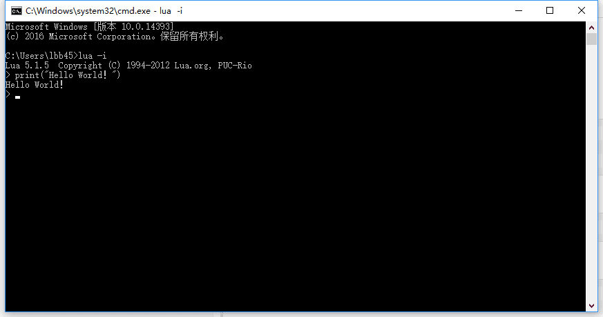
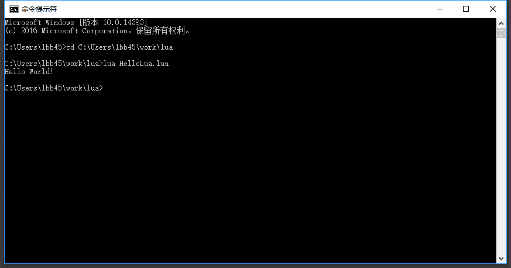
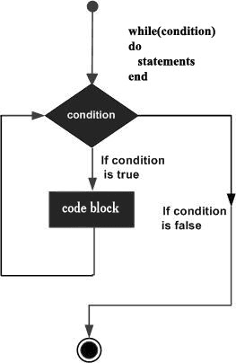
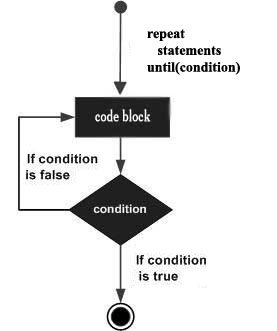
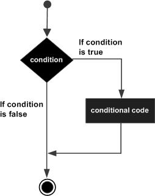
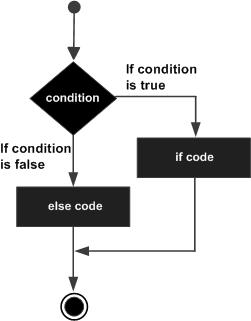
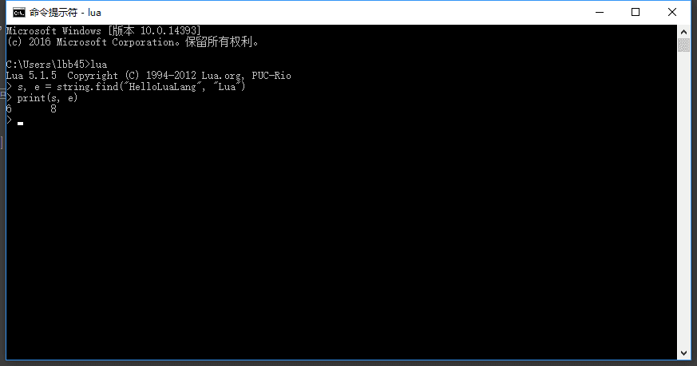

# 教程

## 第一个 Lua 程序

### 交互式编程
Lua 提供了交互式编程模式。我们可以在命令行中输入程序并立即查看效果。
Lua 交互式编程模式可以通过命令 lua -i 或 lua 来启用：



### 脚本式编程
我们可以将 Lua 程序代码保持到一个以 lua 结尾的文件，并执行，该模式称为脚本式编程，如我们将如下代码存储在名为 hello.lua 的脚本文件中：使用 lua 名执行以上脚本，输出结果为：



## 语法

### 注释
- 单行注释是`--`:
```lua
--Lua注释
```
- 多行注释是`--[[`和`--]]`
```lua
--[[ 
    Lua注释
    Lua注释
    Lua注释
--]]
```

### 标示符
Lua 标示符用于定义一个变量，函数获取其他用户定义的项。标示符以一个字母 A 到 Z 或 a 到 z 或下划线 _ 开头后加上0个或多个字母，下划线，数字（0到9）。***最好不要使用下划线加大写字母的标示符，因为Lua的保留字也是这样的。***Lua 不允许使用特殊字符如 @, $, 和 % 来定义标示符。 Lua 是一个区分大小写的编程语言。因此在 Lua 中 W3c 与 w3c 是两个不同的标示符。

### 关键词
以下列出了 Lua 的保留关键字。保留关键字不能作为常量或变量或其他用户自定义标示符：`and` `break` `do` `else` `elseif` `end` `false` `for` `function` `if` `in` `local` `nil` `not` `or` `repeat` `return` `then` `true` `until` `while`一般约定，以下划线开头连接一串大写字母的名字比如 ***`_VERSION`***被保留用于 Lua 内部全局变量。

### 全局变量
在默认情况下，变量总是认为是全局的。全局变量不需要声明，给一个变量赋值后即创建了这个全局变量，访问一个没有初始化的全局变量也不会出错，只不过得到的结果是：nil。
### 数据类型
Lua是动态类型语言，变量不要类型定义,只需要为变量赋值。 值可以存储在变量中，作为参数传递或结果返回。Lua中有8个基本类型分别为：nil、boolean、number、string、userdata、function、thread和table。

数据类型 | 描述
-------|------
nil | 这个最简单，只有值nil属于该类，表示一个无效值（在条件表达式中相当于false）。
boolean | 包含两个值：false和true。
number | 表示双精度类型的实浮点数
string |字符串由一对双引号或单引号来表示
function |由 C 或 Lua 编写的函数
userdata |表示任意存储在变量中的C数据结构
thread |表示执行的独立线路，用于执行协同程序
table |Lua 中的表（table）其实是一个"关联数组"（associative arrays），数组的索引可以是数字或者是字符串。在 Lua 里，table 的创建是通过"构造表达式"来完成，最简单构造表达式是{}，用来创建一个空表。我们可以使用type函数测试给定变量或者值的类型：

```lua
print(type("Hello world"))      --> string
print(type(10.4*3))             --> number
print(type(print))             --> function
print(type(type))             --> function
print(type(true))             --> boolean
print(type(nil))             --> nil
print(type(type(X)))         --> string
```

### 变量
变量在使用前，必须在代码中进行声明，即创建该变量。编译程序执行代码之前编译器需要知道如何给语句变量开辟存储区，用于存储变量的值。Lua 变量有三种类型：*全局变量*、*局部变量*、*表中的域*。Lua 中的变量全是全局变量，那怕是语句块或是函数里，除非用 local 显示声明为局部变量。局部变量的作用域为从声明位置开始到所在语句块结束。变量的默认值均为 nil。

```lua
-- test.lua 文件脚本
a = 5               -- 全局变量
local b = 5         -- 局部变量

function joke()
    c = 5           -- 全局变量
    local d = 6     -- 局部变量
end

joke()
print(c,d)          --> 5 nil

do 
    local a = 6     -- 局部变量
    b = 6           -- 全局变量
    print(a,b);     --> 6 6
end

print(a,b)          --> 5 6
```

### 赋值语句
赋值是改变一个变量的值和改变表域的最基本的方法。Lua可以对多个变量同时赋值，变量列表和值列表的各个元素用逗号分开，赋值语句右边的值会依次赋给左边的变量。遇到赋值语句Lua会先计算右边所有的值然后再执行赋值操作，所以我们可以这样进行交换变量的值：

```lua
a = "hello" .. "world"
t.n = t.n + 1

a, b = 10, 2*x                  -- a=10; b=2*x

x, y = y, x                     -- swap 'x' for 'y'
a[i], a[j] = a[j], a[i]         -- swap 'a[i]' for 'a[j]'
```

当变量个数和值的个数不一致时，Lua会一直以变量个数为基础采取以下策略：

- 变量个数 > 值的个数             按变量个数补足nil
- 变量个数 < 值的个数             多余的值会被忽略

*多值赋值经常用来交换变量，或将函数调用返回给变量：`a, b = f()`*
应该尽可能的使用局部变量，有两个好处：

- 避免命名冲突。
- 访问局部变量的速度比全局变量更快。

### 索引
Lua 也提供了对 table 的索引使用方括号 [] 的操作。

```lua
t[i]
t.i                 -- 当索引为字符串类型时的一种简化写法
gettable_event(t,i) -- 采用索引访问本质上是一个类似这样的函数调用
```

### 循环
很多情况下我们需要做一些有规律性的重复操作，因此在程序中就需要重复执行某些语句。一组被重复执行的语句称之为循环体，能否继续重复，决定循环的终止条件。循环结构是在一定条件下反复执行某段程序的流程结构，被反复执行的程序被称为循环体。循环语句是由循环体及循环的终止条件两部分组成的。Lua 语言提供了以下几种循环处理方式：

循环类型|描述
--|--
while 循环 | 在条件为 true 时，让程序重复地执行某些语句。执行语句前会先检查条件是否为 true。
for 循环 | 重复执行指定语句，重复次数可在 for 语句中控制。
repeat...until | 重复执行循环，直到 指定的条件为真时为止
循环嵌套 | 可以在循环内嵌套一个或多个循环语句（while、for、do..while）

#### 循环控制
循环控制语句用于控制程序的流程， 以实现程序的各种结构方式。
Lua 支持以下循环控制语句：

控制语句|描述
--|--
break 语句|退出当前循环或语句，并开始脚本执行紧接着的语句。
*在循环体中如果条件永远为 true 循环语句就会永远执行下去*

##### while 循环语法：
```lua
while(condition)
do
   statements
end
```

**statements(循环体语句)** 可以是一条或多条语句，**condition(条件)** 可以是任意表达式，在 **condition(条件)** 为 true 时执行循环体语句。
流程图如下：



在以上流程图中我们可以看出在**condition(条件)**为 false 时会跳过当前循环并开始脚本执行紧接着的语句。

#####  for语句有两大类：
- 数值for循环

```lua
for var=exp1,exp2,exp3 do  
    <执行体>  
end  
```
var从exp1变化到exp2，每次变化以exp3为步长递增var，并执行一次"执行体"。exp3是可选的，如果不指定，默认为1。

- 泛型for循环
泛型for循环通过一个迭代器函数来遍历所有值，类似java中的foreach语句。
Lua 编程语言中泛型for循环语法格式:

```lua
-- 打印数组a的所有值  
for i,v in ipairs(a) 
    do print(v) 
end  
```
i是数组索引值，v是对应索引的数组元素值。ipairs是Lua提供的一个迭代器函数，用来迭代数组。

##### repeat...until 循环
repeat...until 循环语句不同于 for 和 while循环，for 和 while 循环的条件语句在当前循环执行开始时判断，而 repeat...until 循环的条件语句在当前循环结束后判断。

```lua
repeat
   statements
until( condition )
```
我们注意到循环条件判断语句（condition）在循环体末尾部分，所以在条件进行判断前循环体都会执行一次。
如果条件判断语句（condition）为 false，循环会重新开始执行，直到条件判断语句（condition）为 true 才会停止执行。
Lua repeat...until 循环流程图如下：


##### 循环嵌套
Lua 编程语言中允许循环中嵌入循环。以下实例演示了 Lua 循环嵌套的应用。

### 流程控制
流程控制语句通过程序设定一个或多个条件语句来设定。在条件为 true 时执行指定程序代码，在条件为 false 时执行其他指定代码。控制结构的条件表达式结果可以是任何值，Lua认为false和nil为假，true和非nil为真。

语句|描述
--|--
if 语句 | **if 语句** 由一个布尔表达式作为条件判断，其后紧跟其他语句组成。
if...else 语句 | **if 语句** 可以与 **else 语句**搭配使用, 在 if 条件表达式为 false 时执行 else 语句代码。
if 嵌套语句 | 你可以在**if** 或 **else if**中使用一个或多个 **if** 或 **else if** 语句 。

#### if 语句
**if 语句** 由一个布尔表达式作为条件判断，其后紧跟其他语句组成。

```lua
if(布尔表达式)
then
   --[ 在布尔表达式为 true 时执行的语句 --]
end
```
在布尔表达式为 true 时会if中的代码块会被执行，在布尔表达式为 false 时，紧跟在 if 语句 end 之后的代码会被执行。
Lua认为false和nil为假，true 和非nil为真。要注意的是Lua中 0 为 true。
if 语句流程图如下：


#### if...else 语句
if 语句可以与 else 语句搭配使用, 在 if 条件表达式为 false 时执行 else 语句代码块。

```lua
if(布尔表达式)
then
   --[ 布尔表达式为 true 时执行该语句块 --]
else
   --[ 布尔表达式为 false 时执行该语句块 --]
end
```
在布尔表达式为 true 时会if中的代码块会被执行，在布尔表达式为 false 时，else 的代码块会被执行。
Lua认为false和nil为假，true 和非nil为真。要注意的是Lua中 0 为 true。
if 语句流程图如下：


##### if...elseif...else 语句
if 语句可以与 elseif...else 语句搭配使用, 在 if 条件表达式为 false 时执行 elseif...else 语句代码块，用于检测多个条件语句。

```lua
if( 布尔表达式 1)
then
   --[ 在布尔表达式 1 为 true 时执行该语句块 --]
elseif( 布尔表达式 2)
then
   --[ 在布尔表达式 2 为 true 时执行该语句块 --]
elseif( 布尔表达式 3)
then
   --[ 在布尔表达式 3 为 true 时执行该语句块 --]
else 
   --[ 如果以上布尔表达式都不为 true 则执行该语句块 --]
end
```

##### 嵌套语句
 if 语句允许嵌套, 这就意味着你可以在一个 if 或 else if 语句中插入其他的 if 或 else if 语句。

### 函数
在Lua中，函数是对语句和表达式进行抽象的主要方法。既可以用来处理一些特殊的工作，也可以用来计算一些值。Lua 提供了许多的内建函数，你可以很方便的在程序中调用它们，如print()函数可以将传入的参数打印在控制台上。

Lua 函数主要有两种用途：

- 完成指定的任务，这种情况下函数作为调用语句使用；
- 计算并返回值，这种情况下函数作为赋值语句的表达式使用。

#### 函数定义

```lua
optional_function_scope function function_name( argument1, argument2, argument3..., argumentn)
    function_body
    return result_params_comma_separated
end
```

名称|解释
--|--
optional_function_scope: | 该参数是可选的制定函数是全局函数还是局部函数，未设置该参数默认为全局函数，如果你需要设置函数为局部函数需要使用关键字 local。
function_name: | 指定函数名称。
argument1, argument2, argument3..., argumentn: | 函数参数，多个参数以逗号隔开，函数也可以不带参数。
function_body: | 函数体，函数中需要执行的代码语句块。
result_params_comma_separated: | 函数返回值，Lua语言函数可以返回多个值，每个值以逗号隔开。

###### 实例
以下实例定义了函数 max()，参数为 num1, num2，用于比较两值的大小，并返回最大值：如下实例：ex1

```lua
--[[ 函数返回两个值的最大值 --]]
function max(num1, num2)

   if (num1 > num2) then
      result = num1;
   else
      result = num2;
   end

   return result; 
end
-- 调用函数
print("两值比较最大值为 ",max(10,4))   -->两值比较最大值为 10
print("两值比较最大值为 ",max(5,6))    -->两值比较最大值为 6
```

在Lua 中我们可以将函数作为参数传递给函数，如下实例：ex2

```lua
myprint = function(param)
   print("这是打印函数 -   ##",param,"##")
end

function add(num1,num2,functionPrint)
   result = num1 + num2
   -- 调用传递的函数参数
   functionPrint(result)
end
myprint(10)                        -->这是打印函数 -   ##    10    ##
-- myprint 函数作为参数传递
add(2,5,myprint)                -->这是打印函数 -   ##    7    ##
```

Lua函数可以返回多个结果值，比如string.find，其返回匹配串"开始和结束的下标"（如果不存在匹配串返回nil）。如下实例：ex3


```lua
function maximum (a)
    local mi = 1             -- 最大值索引
    local m = a[mi]          -- 最大值
    for i,val in ipairs(a) do
       if val > m then
           mi = i
           m = val
       end
    end
    return m, mi
end

print(maximum({8,10,23,12,5}))  -->23    3
```


Lua函数可以接受可变数目的参数，和C语言类似在函数参数列表中使用三点（...) 表示函数有可变的参数。Lua将函数的参数放在一个叫arg的表中，#arg 表示传入参数的个数。如下实例：ex4

```lua
function average(...)
   result = 0
   local arg={...}
   for i,v in ipairs(arg) do
      result = result + v
   end
   print("总共传入 " .. #arg .. " 个数")
   return result/#arg
end

print("平均值为",average(10,5,3,4,5,6))  -->平均值为    5.5
```

### 运算符
运算符是一个特殊的符号，用于告诉解释器执行特定的数学或逻辑运算。Lua提供了以下几种运算符类型：

- 算术运算符
下表列出了 Lua 语言中的常用算术运算符，设定 A 的值为10，B 的值为 20：

操作符|描述|实例
--|--|--
+|加法|`A + B `输出结果 30
-|减法|`A - B` 输出结果 -10
*|乘法|`A * B` 输出结果 200
/|除法|`B / A` 输出结果 2
%|取余|`B % A` 输出结果 0
^|乘幂|`A^2 `输出结果 100
-|负号|`-A `输出结果v -10

- 关系运算符
下表列出了 Lua 语言中的常用关系运算符，设定 A 的值为10，B 的值为 20：

操作符|描述|实例
--|--|--
==|等于，检测两个值是否相等，相等返回 true，否则返回 false|`(A == B)` 为 false。
~=|不等于，检测两个值是否相等，相等返回 false，否则返回 true|`(A ~= B) `为 true。
>|大于，如果左边的值大于右边的值，返回 true，否则返回 false|`(A > B)` 为 false。
<|小于，如果左边的值大于右边的值，返回 false，否则返回 true|`(A < B)` 为 true。
>=|大于等于，如果左边的值大于等于右边的值，返回 true，否则返回 false|`(A >= B)` 返回 false。
<=|小于等于， 如果左边的值小于等于右边的值，返回 true，否则返回 false|`(A <= B)` 返回 true。

- 逻辑运算符
下表列出了 Lua 语言中的常用逻辑运算符，设定 A 的值为 true，B 的值为 false：

操作符|描述|实例
--|--|--
and|逻辑与操作符。 如果两边的操作都为 true 则条件为 true。|`(A and B) `为 false。
or|逻辑或操作符。 如果两边的操作任一一个为 true 则条件为 true。|`(A or B) `为 true。
not|逻辑非操作符。与逻辑运算结果相反，如果条件为 true，逻辑非为 false。|`not(A and B)` 为 true。

- 其他运算符
下表列出了 Lua 语言中的连接运算符与计算表或字符串长度的运算符：

操作符|描述|实例
--|--|--
.. | 连接两个字符串 | `a..b `，其中 a 为 "Hello " ， b 为 "World", 输出结果为 "Hello World"。
# | 一元运算符，返回字符串或表的长度。|`#"Hello"` 返回 5

#### 运算符优先级
从高到低的顺序：
```
^
not    - (unary)
*      /
+      -
..
<      >      <=     >=     ~=     ==
and
or
```
除了^和..外所有的二元运算符都是左连接的。
```
a+i < b/2+1          <-->       (a+i) < ((b/2)+1)
5+x^2*8              <-->       5+((x^2)*8)
a < y and y <= z     <-->       (a < y) and (y <= z)
-x^2                 <-->       -(x^2)
x^y^z                <-->       x^(y^z)
```

### 字符串
字符串或串(String)是由数字、字母、下划线组成的一串字符。Lua 语言中字符串可以使用以下三种方式来表示：

- 单引号间的一串字符。
- 双引号间的一串字符。
- [[和]]间的一串字符。

转义字符用于表示不能直接显示的字符，比如后退键，回车键，等。如在字符串转换双引号可以使用 "\""。所有的转义字符和所对应的意义：

转义字符|意义|ASCII码值（十进制）
--|--|--
\a|响铃(BEL)|007
\b|退格(BS) ，将当前位置移到前一列|008
\f|换页(FF)，将当前位置移到下页开头|012
\n|换行(LF) ，将当前位置移到下一行开头|010
\r|回车(CR) ，将当前位置移到本行开头|013
\t|水平制表(HT) （跳到下一个TAB位置）|009
\v|垂直制表(VT)|011
\\|代表一个反斜线字符''\'|092
\'|代表一个单引号（撇号）字符|039
\"|代表一个双引号字符|034
\0|空字符(NULL)|000
\ddd|1到3位八进制数所代表的任意字符|三位八进制
\xhh|1到2位十六进制所代表的任意字符|二位十六进制

字符串操作
Lua 提供了很多的方法来支持字符串的操作：

1. `string.upper(argument)`:字符串全部转为大写字母。
- `string.lower(argument)`:字符串全部转为小写字母。
- `string.gsub(mainString,findString,replaceString,num)`在字符串中替换,mainString为要替换的字符串， findString 为被替换的字符，replaceString 要替换的字符，num 替换次数（可以忽略，则全部替换）。
- `string.strfind (str, substr, [init, [end]])`在一个指定的目标字符串中搜索指定的内容(第三个参数为索引),返回其具体位置。不存在则返回 nil。
- `string.reverse(arg)`字符串反转
- `string.format(...)`返回一个类似printf的格式化字符串
- `string.char(arg) 和 string.byte(arg[,int])`char 将整型数字转成字符并连接， byte 转换字符为整数值(可以指定某个字符，默认第一个字符)。
- `string.len(arg)`计算字符串长度。string.len("abc")3
- `string.rep(string, n))`返回字符串string的n个拷贝
- `..`链接两个字符串

### 数组
数组，就是相同数据类型的元素按一定顺序排列的集合，可以是一维数组和多维数组。Lua 数组的索引键值可以使用整数表示，数组的大小不是固定的。

一维数组是最简单的数组，其逻辑结构是线性表。一维数组可以用for循环出数组中的元素，如下实例：ex5

```lua
array = {"Lua", "Tutorial"}

for i= 0, 2 do
   print(array[i])    -->nil
                    -->Lua
                    -->Tutorial
end
```
正如你所看到的，我们可以使用整数索引来访问数组元素，如果知道的索引没有值则返回nil。在 Lua 索引值是以 1 为起始，但你也可以指定 0 开始。除此外我们还可以以负数为数组索引值：如下实例：ex6

```lua
array = {}

for i= -2, 2 do
   array[i] = i *2
end

for i = -2,2 do
   print(array[i])    -->-4
                    -->-2
                    -->0
                    -->2
                    -->4
end
```

### 多维数组
多维数组即数组中包含数组或一维数组的索引键对应一个数组。如下实例是一个三行三列的阵列多维数组：ex7

```lua
-- 初始化数组
array = {}
for i=1,3 do
   array[i] = {}
      for j=1,3 do
         array[i][j] = i*j
      end
end

-- 访问数组
for i=1,3 do
   for j=1,3 do
      print(array[i][j])    -->1
                            -->2
                            -->3
                            -->2
                            -->4
                            -->6
                            -->3
                            -->6
                            -->9
   end
end

```

### 迭代器
迭代器（iterator）是一种对象，它能够用来遍历标准模板库容器中的部分或全部元素，每个迭代器对象代表容器中的确定的地址在Lua中迭代器是一种支持指针类型的结构，它可以遍历集合的每一个元素。

#### 泛型 for 迭代器
泛型 for 在自己内部保存迭代函数，实际上它保存三个值：迭代函数、状态常量、控制变量。提供了集合的 key/value 对，语法格式如下：

```lua
for k, v in pairs(t) do
    print(k, v)
end
```
上面代码中，k, v为变量列表；pair(t)为表达式列表。如下实例：ex8
```
array = {"Lua", "Tutorial"}

for key,value in ipairs(array)
do
   print(key, value)    -->1    Lua
                        -->2    Tutorial
end
```
以上实例中我们使用了 Lua 默认提供的迭代函数 ipairs。

- 下面我们看看范性for的执行过程：
    - 首先，初始化，计算in后面表达式的值，表达式应该返回范性for需要的三个值：迭代函数、状态常量、控制变量；与多值赋值一样，如果表达式返回的结果个数不足三个会自动用nil补足，多出部分会被忽略。
    - 第二，将状态常量和控制变量作为参数调用迭代函数（注意：对于for结构来说，状态常量没有用处，仅仅在初始化时获取他的值并传递给迭代函数）。
    - 第三，将迭代函数返回的值赋给变量列表。
    - 第四，如果返回的第一个值为nil循环结束，否则执行循环体。
    - 第五，回到第二步再次调用迭代函数
- 在Lua中我们常常使用函数来描述迭代器，每次调用该函数就返回集合的下一个元素。Lua 的迭代器包含以下两种类型：
    - 无状态的迭代器
    - 多状态的迭代器

#### 无状态的迭代器
无状态的迭代器是指不保留任何状态的迭代器，因此在循环中我们可以利用无状态迭代器避免创建闭包花费额外的代价。
每一次迭代，迭代函数都是用两个变量（状态常量和控制变量）的值作为参数被调用，一个无状态的迭代器只利用这两个值可以获取下一个元素。
这种无状态迭代器的典型的简单的例子是ipairs，他遍历数组的每一个元素。
以下实例我们使用了一个简单的函数来实现迭代器，实现 数字 n 的平方：ex9

```lua
function square(iteratorMaxCount,currentNumber)
   if currentNumber<iteratorMaxCount
   then
      currentNumber = currentNumber+1
   return currentNumber, currentNumber*currentNumber
   end
end

for i,n in square,3,0
do
   print(i,n)   -->1    1
                -->2    4
                -->3    9
end
```
#### 多状态的迭代器
很多情况下，迭代器需要保存多个状态信息而不是简单的状态常量和控制变量，最简单的方法是使用闭包，还有一种方法就是将所有的状态信息封装到table内，将table作为迭代器的状态常量，因为这种情况下可以将所有的信息存放在table内，所以迭代函数通常不需要第二个参数。
以下实例我们创建了自己的迭代器：ex10

```lua
array = {"Lua", "Tutorial"}

function elementIterator (collection)
   local index = 0
   local count = #collection
   -- 闭包函数
   return function ()
      index = index + 1
      if index <= count
      then
         --  返回迭代器的当前元素
         return collection[index]
      end
   end
end

for element in elementIterator(array)
do
   print(element)   -->Lua
                    -->Tutorial
end
```

### table(表)
table 是 Lua 的一种数据结构用来帮助我们创建不同的数据类型，如：数字、字典等。

- 使用关联型数组，你可以用任意类型的值来作数组的索引，但这个值不能是 nil。
- 不固定大小的，你可以根据自己需要进行扩容。
- 通过table来解决模块（module）、包（package）和对象（Object）的。 例如string.format表示使用"format"来索引table string。

#### table(表)的构造
构造器是创建和初始化表的表达式。表是Lua特有的功能强大的东西。最简单的构造函数是{}，用来创建一个空表。可以直接初始化数组:

```lua
-- 初始化表
mytable = {}

-- 指定值
mytable[1]= "Lua"

-- 移除引用
mytable = nil
-- lua 垃圾回收会释放内存
```
当我们为 table a 并设置元素，然后将 a 赋值给 b，则 a 与 b 都指向同一个内存。如果 a 设置为 nil ，则 b 同样能访问 table 的元素。如果没有指定的变量指向a，Lua的垃圾回收机制会清理相对应的内存。

```lua
-- 简单的 table
mytable = {}
print("mytable 的类型是 ",type(mytable))

mytable[1]= "Lua"
mytable["wow"] = "修改前"
print("mytable 索引为 1 的元素是 ", mytable[1])
print("mytable 索引为 wow 的元素是 ", mytable["wow"])

-- alternatetable和mytable的是指同一个 table
alternatetable = mytable

print("alternatetable 索引为 1 的元素是 ", alternatetable[1])
print("mytable 索引为 wow 的元素是 ", alternatetable["wow"])

alternatetable["wow"] = "修改后"

print("mytable 索引为 wow 的元素是 ", mytable["wow"])

-- 释放变量
alternatetable = nil
print("alternatetable 是 ", alternatetable)

-- mytable 仍然可以访问
print("mytable 索引为 wow 的元素是 ", mytable["wow"])

mytable = nil
print("mytable 是 ", mytable)   -->mytable 的类型是     table
                                -->mytable 索引为 1 的元素是     Lua
                                -->mytable 索引为 wow 的元素是     修改前
                                -->alternatetable 索引为 1 的元素是     Lua
                                -->mytable 索引为 wow 的元素是     修改前
                                -->mytable 索引为 wow 的元素是     修改后
                                -->alternatetable 是     nil
                                -->mytable 索引为 wow 的元素是     修改后
                                -->mytable 是     nil
```

#### Table 操作
以下列出了 Table 操作常用的方法：

1. `table.concat (table [, sep [, start [, end]]])`:concat是concatenate(连锁, 连接)的缩写. table.concat()函数列出参数中指定table的数组部分从start位置到end位置的所有元素, 元素间以指定的分隔符(sep)隔开。
- `table.insert (table, [pos,] value)`:在table的数组部分指定位置(pos)插入值为value的一个元素. pos参数可选, 默认为数组部分末尾.
- `table.maxn(table)`:指定table中所有正数key值中最大的key值. 如果不存在key值为正数的元素, 则返回0。(**Lua5.2之后该方法已经不存在了,本文使用了自定义函数实现**)

```lua
function table_maxn(t)
    local mn = 0
    for k, v in pairs(t) do
        if mn < k then
            mn = k
        end
    end
    return mn
end
tbl = {[1] = "a", [2] = "b", [3] = "c", [26] = "z"}
print("tbl 长度 ", #tbl)                -->tbl 长度     3
print("tbl 最大值 ", table_maxn(tbl))    -->tbl 最大值     26
```

- `table.remove (table [, pos])`:返回table数组部分位于pos位置的元素. 其后的元素会被前移. pos参数可选, 默认为table长度, 即从最后一个元素删起。
- `table.sort (table [, comp])`:对给定的table进行升序排序。

### 模块与包
模块类似于一个封装库，从 Lua 5.1 开始，Lua 加入了标准的模块管理机制，可以把一些公用的代码放在一个文件里，以 API 接口的形式在其他地方调用，有利于代码的重用和降低代码耦合度。Lua 的模块是由变量、函数等已知元素组成的 table，因此创建一个模块很简单，就是创建一个 table，然后把需要导出的常量、函数放入其中，最后返回这个 table 就行。以下为创建自定义模块 module.lua，文件代码格式如下：

```lua
-- 文件名为 module.lua
-- 定义一个名为 module 的模块
module = {}
 
-- 定义一个常量
module.constant = "这是一个常量"
 
-- 定义一个函数
function module.func1()
    io.write("这是一个公有函数！\n")
end
 
local function func2()
    print("这是一个私有函数！")
end
 
function module.func3()
    func2()
end
 
return module
```
由上可知，模块的结构就是一个 table 的结构，因此可以像操作调用 table 里的元素那样来操作调用模块里的常量或函数。

#### require 函数
Lua提供了一个名为require的函数用来加载模块。要加载一个模块，只需要简单地调用就可以了。例如：
`require("<模块名>")`或者`require "<模块名>"`
执行 require 后会返回一个由模块常量或函数组成的 table，并且还会定义一个包含该 table 的全局变量。

```lua
-- test_module.lua 文件
-- module 模块为上文提到到 module.lua
require("module")
 
print(module.constant)
 
module.func3()
```

或者给加载的模块定义一个别名变量，方便调用：

```lua
-- test_module2.lua 文件
-- module 模块为上文提到到 module.lua
-- 别名变量 m
local m = require("module")
 
print(m.constant)
 
m.func3()
```

#### 加载机制
对于自定义的模块，模块文件不是放在哪个文件目录都行，函数 require 有它自己的文件路径加载策略，它会尝试从 Lua 文件或 C 程序库中加载模块。
require 用于搜索 Lua 文件的路径是存放在全局变量 package.path 中，当 Lua 启动后，会以环境变量 LUA_PATH 的值来初始这个环境变量。如果没有找到该环境变量，则使用一个编译时定义的默认路径来初始化。
当然，如果没有 LUA_PATH 这个环境变量，也可以自定义设置，在当前用户根目录下打开 .profile 文件（没有则创建，打开 .bashrc 文件也可以）。

### C 包
Lua和C是很容易结合的，使用C为Lua写包。
与Lua中写包不同，C包在使用以前必须首先加载并连接，在大多数系统中最容易的实现方式是通过动态连接库机制。
Lua在一个叫loadlib的函数内提供了所有的动态连接的功能。这个函数有两个参数:库的绝对路径和初始化函数。所以典型的调用的例子如下:
```
local path = "/usr/local/lua/lib/libluasocket.so"
local f = loadlib(path, "luaopen_socket")
```
loadlib函数加载指定的库并且连接到Lua，然而它并不打开库（也就是说没有调用初始化函数），反之他返回初始化函数作为Lua的一个函数，这样我们就可以直接在Lua中调用他。
如果加载动态库或者查找初始化函数时出错，loadlib将返回nil和错误信息。我们可以修改前面一段代码，使其检测错误然后调用初始化函数：
```
local path = "/usr/local/lua/lib/libluasocket.so"
-- 或者 path = "C:\\windows\\luasocket.dll"，这是 Window 平台下
local f = assert(loadlib(path, "luaopen_socket"))
f()  -- 真正打开库
```
一般情况下我们期望二进制的发布库包含一个与前面代码段相似的stub文件，安装二进制库的时候可以随便放在某个目录，只需要修改stub文件对应二进制库的实际路径即可。
将stub文件所在的目录加入到LUA_PATH，这样设定后就可以使用require函数加载C库了。

### 元表(Metatable)
在 Lua table 中我们可以访问对应的key来得到value值，但是却无法对两个 table 进行操作。
因此 Lua 提供了元表(Metatable)，允许我们改变table的行为，每个行为关联了对应的元方法。
例如，使用元表我们可以定义Lua如何计算两个table的相加操作a+b。
当Lua试图对两个表进行相加时，先检查两者之一是否有元表，之后检查是否有一个叫"__add"的字段，若找到，则调用对应的值。"__add"等即时字段，其对应的值（往往是一个函数或是table）就是"元方法"。
有两个很重要的函数来处理元表：
- `setmetatable(table,metatable)`: 对指定table设置元表(metatable)，如果元表(metatable)中存在__metatable键值，setmetatable会失败 。
- `getmetatable(table)`: 返回对象的元表(metatable)。
以下实例演示了如何对指定的表设置元表：
```
mytable = {}                          -- 普通表 
mymetatable = {}                      -- 元表
setmetatable(mytable,mymetatable)     -- 把 mymetatable 设为 mytable 的元表 
--OR
mytable = setmetatable({},{})
--返回对象元表
getmetatable(mytable) -- 这回返回mymetatable
```

#### `__index` 元方法
这是 metatable 最常用的键。
当你通过键来访问 table 的时候，如果这个键没有值，那么Lua就会寻找该table的metatable（假定有metatable）中的`__index` 键。如果`__index`包含一个表格，Lua会在表格中查找相应的键。
Lua查找一个表元素时的规则，其实就是如下3个步骤:

1. 在表中查找，如果找到，返回该元素，找不到则继续
2. 判断该表是否有元表，如果没有元表，返回nil，有元表则继续。
3. 判断元表有没有__index方法，如果__index方法为nil，则返回nil；如果`__index`方法是一个表，则重复1、2、3；如果    判断元表有没有`__index`方法，如果`__index`方法为nil，则返回nil；如果`__index`方法是一个表，则重复1、2、3；如果方法是一个函数，则返回该函数的返回值。

#### `__newindex` 元方法
`__newindex` 元方法用来对表更新，`__index`则用来对表访问 。
当你给表的一个缺少的索引赋值，解释器就会查找`__newindex` 元方法：如果存在则调用这个函数而不进行赋值操作。

#### `__call` 元方法
`__call` 元方法在 Lua 调用一个值时调用。以下实例演示了计算表中元素的和：

```lua
-- 计算表中最大值，table.maxn在Lua5.2以上版本中已无法使用
-- 自定义计算表中最大值函数 table_maxn
function table_maxn(t)
    local mn = 0
    for k, v in pairs(t) do
        if mn < k then
            mn = k
        end
    end
    return mn
end
-- 定义元方法__call
mytable = setmetatable({10}, {
  __call = function(mytable, newtable)
    sum = 0
    for i = 1, table_maxn(mytable) do
        sum = sum + mytable[i]
    end
    for i = 1, table_maxn(newtable) do
        sum = sum + newtable[i]
    end
    return sum
  end
})
newtable = {10,20,30}
print(mytable(newtable))  -- 以上实例执行输出结果为：70
```

#### `__tostring` 元方法
`_tostring` 元方法用于修改表的输出行为。以下实例我们自定义了表的输出内容：

```lua
mytable = setmetatable({ 10, 20, 30 }, {
  __tostring = function(mytable)
    sum = 0
    for k, v in pairs(mytable) do
        sum = sum + v
    end
    return "表所有元素的和为 " .. sum
  end
})
print(mytable)  --以上实例执行输出结果为：表所有元素的和为 60
```

### 为表添加操作符
以下实例演示了两表相加操作：

```lua
-- 计算表中最大值，table.maxn在Lua5.2以上版本中已无法使用
-- 自定义计算表中最大值函数 table_maxn
function table_maxn(t)
    local mn = 0
    for k, v in pairs(t) do
        if mn < k then
            mn = k
        end
    end
    return mn
end

-- 两表相加操作
mytable = setmetatable({ 1, 2, 3 }, {
  __add = function(mytable, newtable)
    for i = 1, table_maxn(newtable) do
      table.insert(mytable, table_maxn(mytable)+1,newtable[i])
    end
    return mytable
  end
})

secondtable = {4,5,6}

mytable = mytable + secondtable
    for k,v in ipairs(mytable) do
print(k,v)
end
```

`__add` 键包含在元表中，并进行相加操作。 表中对应的操作列表如下：

模式|运算符
-|-
__add| +
__sub|-
__mul|*
__div|/
__mod|%
__unm|-
__concat|..
__eq|==
__lt|<
__le|<=

## 协同程序(coroutine)*
Lua 协同程序(coroutine)与线程比较类似：拥有独立的堆栈，独立的局部变量，独立的指令指针，同时又与其它协同程序共享全局变量和其它大部分东西。协同是非常强大的功能，但是用起来也很复杂。线程与协同程序的主要区别在于，一个具有多个线程的程序可以同时运行几个线程，而协同程序却需要彼此协作的运行。在任一指定时刻只有一个协同程序在运行，并且这个正在运行的协同程序只有在明确的被要求挂起的时候才会被挂起。协同程序有点类似同步的多线程，在等待同一个线程锁的几个线程有点类似协同。
基本语法:

方法|描述
--|--
coroutine.create()|创建coroutine，返回coroutine， 参数是一个函数，当和resume配合使用的时候就唤醒函数调用
coroutine.resume()|重启coroutine，和create配合使用
coroutine.yield()|挂起coroutine，将coroutine设置为挂起状态，这个和resume配合使用能有很多有用的效果
coroutine.status()|查看coroutine的状态 *注：coroutine的状态有三种：dead，suspend，running，具体什么时候有这样的状态请参考下面的程序*
coroutine.wrap()|创建coroutine，返回一个函数，一旦你调用这个函数，就进入coroutine，和create功能重复
coroutine.running()|返回正在跑的coroutine，一个coroutine就是一个线程，当使用running的时候，就是返回一个corouting的线程号

## 文件 I/O

### 错误处理

### 调试(Debug)

### 垃圾回收
Lua 采用了自动内存管理。 这意味着你不用操心新创建的对象需要的内存如何分配出来， 也不用考虑在对象不再被使用后怎样释放它们所占用的内存。
Lua 运行了一个**垃圾收集器**来收集所有**死对象** （即在 Lua 中不可能再访问到的对象）来完成自动内存管理的工作。 Lua 中所有用到的内存，如：字符串、表、用户数据、函数、线程、 内部结构等，都服从自动管理。
Lua 实现了一个增量标记-扫描收集器。 它使用这两个数字来控制垃圾收集循环： 垃圾收集器间歇率和垃圾收集器步进倍率。 这两个数字都使用百分数为单位 （例如：值 100 在内部表示 1 ）。
垃圾收集器间歇率控制着收集器需要在开启新的循环前要等待多久。 增大这个值会减少收集器的积极性。 当这个值比 100 小的时候，收集器在开启新的循环前不会有等待。 设置这个值为 200 就会让收集器等到总内存使用量达到 之前的两倍时才开始新的循环。
垃圾收集器步进倍率控制着收集器运作速度相对于内存分配速度的倍率。 增大这个值不仅会让收集器更加积极，还会增加每个增量步骤的长度。 不要把这个值设得小于 100 ， 那样的话收集器就工作的太慢了以至于永远都干不完一个循环。 默认值是 200 ，这表示收集器以内存分配的"两倍"速工作。
如果你把步进倍率设为一个非常大的数字 （比你的程序可能用到的字节数还大 10% ）， 收集器的行为就像一个 stop-the-world 收集器。 接着你若把间歇率设为 200 ， 收集器的行为就和过去的 Lua 版本一样了： 每次 Lua 使用的内存翻倍时，就做一次完整的收集。

### 垃圾回收器函数
Lua 提供了以下函数**collectgarbage ([opt [, arg]])**用来控制自动内存管理:

- ***`collectgarbage("collect")`: ***做一次完整的垃圾收集循环。通过参数 opt 它提供了一组不同的功能：
- ***`collectgarbage("count")`: ***以 K 字节数为单位返回 Lua 使用的总内存数。 这个值有小数部分，所以只需要乘上 1024 就能得到 Lua 使用的准确字节数（除非溢出）。
- ***`collectgarbage("restart")`: ***重启垃圾收集器的自动运行。
- ***`collectgarbage("setpause")`: ***将 arg 设为收集器的 间歇率 （参见 §2.5）。 返回 间歇率 的前一个值。
- ***`collectgarbage("setstepmul")`: ***返回 步进倍率 的前一个值。
- ***`collectgarbage("step")`: ***单步运行垃圾收集器。 步长"大小"由 arg 控制。 传入 0 时，收集器步进（不可分割的）一步。 传入非 0 值， 收集器收集相当于 Lua 分配这些多（K 字节）内存的工作。 如果收集器结束一个循环将返回 true 。
- ***`collectgarbage("stop")`: ***停止垃圾收集器的运行。 在调用重启前，收集器只会因显式的调用运行。

## 面向对象
我们知道，对象由属性和方法组成。
LUA中最基本的结构是table，所以需要用table来描述对象的属性；lua中的function可以用来表示方法。
那么LUA中的类可以通过table + function模拟出来。
至于继承，可以通过metetable模拟出来（不推荐用，只模拟最基本的对象大部分时间够用了）。
Lua中的表不仅在某种意义上是一种对象。像对象一样，表也有状态（成员变量）；也有与对象的值独立的本性，特别是拥有两个不同值的对象（table）代表两个不同的对象；一个对象在不同的时候也可以有不同的值，但他始终是一个对象；与对象类似，表的生命周期与其由什么创建、在哪创建没有关系。对象有他们的成员函数，表也有：

```lua
Account = {balance = 0}
function Account.withdraw (v) 
    Account.balance = Account.balance - v
end
```
这个定义创建了一个新的函数，并且保存在Account对象的withdraw域内，下面我们可以这样调用：

```lua
Account.withdraw(100.00)
```
### 一个简单实例

以下简单的类包含了三个属性： area, length 和 breadth，printArea方法用于打印计算结果：ex13

```lua
-- Meta class
Rectangle = {area = 0, length = 0, breadth = 0}

-- 派生类的方法 new
function Rectangle:new (o,length,breadth)
  o = o or {}
  setmetatable(o, self)
  self.__index = self
  self.length = length or 0
  self.breadth = breadth or 0
  self.area = length*breadth;
  return o
end

-- 派生类的方法 printArea
function Rectangle:printArea ()
  print("矩形面积为 ",self.area)
end
```

创建对象是位类的实例分配内存的过程。每个类都有属于自己的内存并共享公共数据。(*内存在对象初始化时分配。*)

 ```lua
r = Rectangle:new(nil,10,20)
```

我们可以使用点号(.)来访问类的属性：

```lua
print(r.length)
```

我们可以使用冒号(:)来访问类的成员函数：

```lua
r:printArea()
```

### 继承
继承是指一个对象直接使用另一对象的属性和方法。可用于扩展基础类的属性和方法。
以下演示了一个简单的继承实例：ex14

```lua
Shape = {area = 0}
-- 基础类方法 new
function Shape:new (o,side)
  o = o or {}
  setmetatable(o, self)
  self.__index = self
  side = side or 0
  self.area = side*side;
  return o
end
-- 基础类方法 printArea
function Shape:printArea ()
  print("面积为 ",self.area)         -->面积为  100
end

-- 创建对象
myshape = Shape:new(nil,10)
myshape:printArea()

Square = Shape:new()
-- 派生类方法 new
function Square:new (o,side)
  o = o or Shape:new(o,side)
  setmetatable(o, self)
  self.__index = self
  return o
end

-- 派生类方法 printArea
function Square:printArea ()
  print("正方形面积为 ",self.area)   -->正方形面积为   100
end

-- 创建对象
mysquare = Square:new(nil,10)
mysquare:printArea()

Rectangle = Shape:new()
-- 派生类方法 new
function Rectangle:new (o,length,breadth)
  o = o or Shape:new(o)
  setmetatable(o, self)
  self.__index = self
  self.area = length * breadth
  return o
end

-- 派生类方法 printArea
function Rectangle:printArea ()
  print("矩形面积为 ",self.area)     -->矩形面积为  200
end

-- 创建对象
myrectangle = Rectangle:new(nil,10,20)
myrectangle:printArea()

```

## 数据库访问